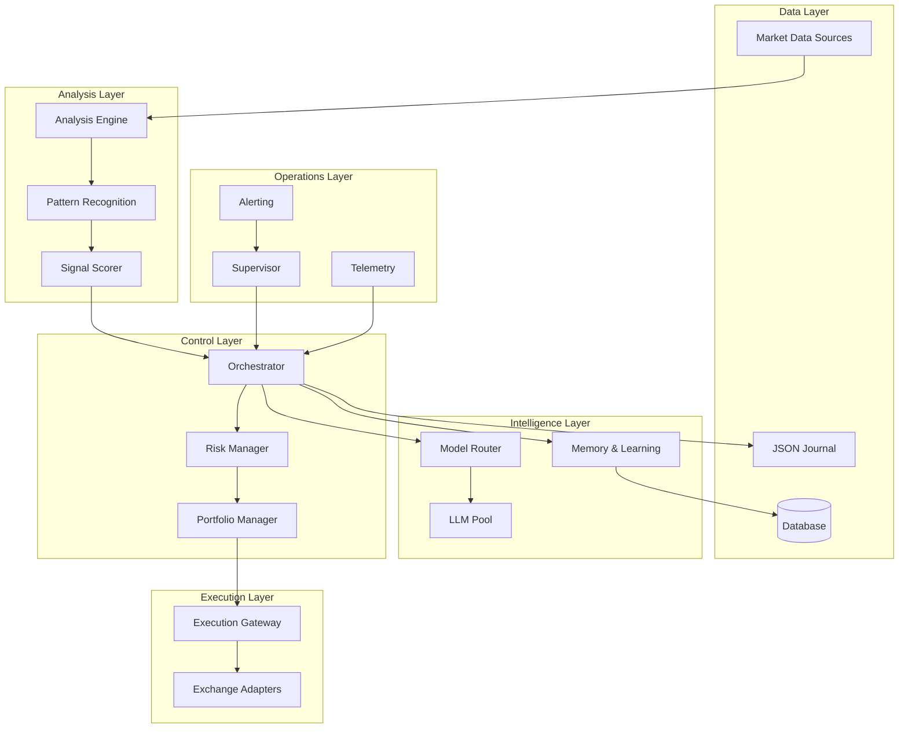

# Design Document

## Overview

The Autonomous Trading System is designed as a microservices-based architecture with clear separation of concerns. The system consists of a Python-based orchestrator that coordinates analysis, risk management, and execution through specialized components. A Rust-based execution gateway ensures high-performance, reliable order processing, while a multi-LLM router provides intelligent model selection for market analysis.

The architecture emphasizes fault tolerance, observability, and autonomous operation through comprehensive logging, self-recovery mechanisms, and adaptive algorithms that learn from trading performance.

## Architecture



## Components and Interfaces

### Orchestrator (Python)
**Purpose**: Central coordinator that manages the trading pipeline and decision-making process.

**Key Responsibilities**:
- Schedule market analysis across multiple timeframes
- Coordinate between analysis, risk, and execution components
- Manage trading state and position lifecycle
- Handle configuration and dynamic parameter adjustment

**Interfaces**:
```python
class Orchestrator:
    def tick(self, symbol: str, timeframe: str) -> None
    def process_signal(self, signal: TradingSignal) -> Decision
    def manage_positions(self) -> None
    def handle_market_regime_change(self, regime: MarketRegime) -> None
```

### Analysis Engine (Python)
**Purpose**: Fetches market data and computes technical indicators across multiple timeframes.

**Key Responsibilities**:
- Retrieve OHLCV data from multiple sources
- Calculate 10+ technical indicators (RSI, EMA, MACD, etc.)
- Normalize data across different timeframes
- Handle data quality and missing data scenarios

**Interfaces**:
```python
class AnalysisEngine:
    def fetch_market_data(self, symbol: str, timeframes: List[str]) -> MarketData
    def compute_indicators(self, data: MarketData) -> IndicatorSet
    def validate_data_quality(self, data: MarketData) -> bool
```

### Pattern Recognition (Python)
**Purpose**: Detects chart patterns and technical formations across timeframes.

**Key Responsibilities**:
- Identify support/resistance levels
- Detect breakout patterns and trend changes
- Recognize candlestick patterns
- Calculate pattern confidence scores

**Interfaces**:
```python
class PatternRecognition:
    def detect_patterns(self, data: MarketData, indicators: IndicatorSet) -> List[Pattern]
    def calculate_pattern_confidence(self, pattern: Pattern) -> float
    def identify_support_resistance(self, data: MarketData) -> SRLevels
```

### Signal Scorer (Python)
**Purpose**: Combines indicators, patterns, and LLM analysis into unified confluence scores.

**Key Responsibilities**:
- Weight and combine multiple signal sources
- Generate confidence scores with reasoning
- Calibrate scores using historical performance
- Adapt scoring based on market regime

**Interfaces**:
```python
class SignalScorer:
    def calculate_confluence(self, indicators: IndicatorSet, patterns: List[Pattern], llm_analysis: LLMAnalysis) -> ConfluenceScore
    def calibrate_scores(self, historical_data: List[Trade]) -> None
    def adapt_to_regime(self, regime: MarketRegime) -> None
```

### Model Router (Python)
**Purpose**: Intelligently routes requests across multiple LLM providers based on accuracy, cost, and latency.

**Key Responsibilities**:
- Maintain pool of 5+ LLM models
- Implement routing policies (AccuracyFirst, CostAware, LatencyAware)
- Handle model failures and fallbacks
- Track model performance metrics

**Interfaces**:
```python
class ModelRouter:
    def route_request(self, prompt: str, context: Dict) -> LLMResponse
    def update_model_performance(self, model_id: str, metrics: ModelMetrics) -> None
    def handle_model_failure(self, model_id: str, error: Exception) -> str
```

### Risk Manager (Python)
**Purpose**: Enforces risk limits and portfolio constraints.

**Key Responsibilities**:
- Calculate position sizes based on risk parameters
- Monitor portfolio exposure and correlation
- Implement drawdown protection mechanisms
- Manage stop-loss and take-profit levels

**Interfaces**:
```python
class RiskManager:
    def calculate_position_size(self, signal: TradingSignal, portfolio: Portfolio) -> PositionSize
    def check_risk_limits(self, proposed_trade: Trade) -> RiskAssessment
    def monitor_drawdown(self, portfolio: Portfolio) -> DrawdownStatus
    def trigger_safe_mode(self, reason: str) -> None
```

### Execution Gateway (Rust)
**Purpose**: High-performance, reliable order execution with idempotency and retry logic.

**Key Responsibilities**:
- Execute orders across multiple exchanges
- Ensure idempotent order processing
- Implement retry logic with circuit breakers
- Handle partial fills and order amendments

**Interfaces**:
```rust
pub trait ExecutionGateway {
    fn place_order(&self, order: OrderRequest) -> Result<OrderResponse>;
    fn cancel_order(&self, order_id: &str) -> Result<CancelResponse>;
    fn get_order_status(&self, order_id: &str) -> Result<OrderStatus>;
    fn handle_partial_fill(&self, fill: PartialFill) -> Result<()>;
}
```

### Memory & Learning (Python)
**Purpose**: Tracks trading performance and adapts strategies using machine learning techniques.

**Key Responsibilities**:
- Store and analyze trade outcomes
- Implement multi-armed bandit algorithms
- Adapt pattern weights based on performance
- Maintain rolling performance windows

**Interfaces**:
```python
class MemoryLearning:
    def record_trade_outcome(self, trade: CompletedTrade) -> None
    def update_pattern_weights(self, pattern_id: str, outcome: TradeOutcome) -> None
    def get_adaptive_position_size(self, base_size: float, confidence: float) -> float
    def analyze_performance_trends(self) -> PerformanceAnalysis
```

## Data Models

### Core Trading Models
```python
@dataclass
class MarketData:
    symbol: str
    timeframe: str
    ohlcv: List[OHLCV]
    timestamp: datetime
    
@dataclass
class TradingSignal:
    symbol: str
    direction: Direction  # LONG, SHORT
    confidence: float
    confluence_score: float
    reasoning: str
    timeframe_analysis: Dict[str, TimeframeAnalysis]
    
@dataclass
class Trade:
    id: str
    symbol: str
    side: Side
    size: float
    entry_price: float
    stop_loss: float
    take_profit: float
    status: TradeStatus
    created_at: datetime
    
@dataclass
class Portfolio:
    total_equity: float
    available_margin: float
    positions: List[Position]
    daily_pnl: float
    unrealized_pnl: float
```

### LLM Integration Models
```python
@dataclass
class LLMRequest:
    prompt: str
    model_id: str
    context: Dict
    max_tokens: int
    temperature: float
    
@dataclass
class LLMResponse:
    content: str
    model_id: str
    tokens_used: int
    latency_ms: int
    cost_usd: float
    confidence: float
```

### Performance Tracking Models
```python
@dataclass
class PatternPerformance:
    pattern_id: str
    win_rate: float
    expectancy: float
    avg_return_multiple: float
    avg_holding_time: timedelta
    sample_size: int
    last_updated: datetime
```

## Error Handling

### Error Classification System
The system categorizes errors into four main types:

1. **Data Errors**: Missing data, API timeouts, data quality issues
2. **Risk Errors**: Limit violations, correlation breaches, drawdown triggers
3. **Execution Errors**: Order failures, exchange connectivity, partial fills
4. **LLM Errors**: Model timeouts, rate limits, invalid responses

### Recovery Strategies
```python
class ErrorHandler:
    def handle_data_error(self, error: DataError) -> RecoveryAction:
        # Retry with backoff, switch data source, use cached data
        
    def handle_risk_error(self, error: RiskError) -> RecoveryAction:
        # Trigger safe mode, reduce position sizes, tighten stops
        
    def handle_execution_error(self, error: ExecutionError) -> RecoveryAction:
        # Retry order, switch exchange, cancel and resubmit
        
    def handle_llm_error(self, error: LLMError) -> RecoveryAction:
        # Switch model, use cached analysis, reduce confidence
```

### Circuit Breaker Implementation
```python
class CircuitBreaker:
    def __init__(self, failure_threshold: int, recovery_timeout: int):
        self.failure_count = 0
        self.failure_threshold = failure_threshold
        self.recovery_timeout = recovery_timeout
        self.state = CircuitState.CLOSED
        
    def call(self, func: Callable) -> Any:
        if self.state == CircuitState.OPEN:
            if self._should_attempt_reset():
                self.state = CircuitState.HALF_OPEN
            else:
                raise CircuitBreakerOpenError()
```

## Testing Strategy

### Unit Testing
- **Analysis Engine**: Test indicator calculations against known values
- **Pattern Recognition**: Validate pattern detection with synthetic data
- **Risk Manager**: Test limit enforcement and position sizing
- **Model Router**: Mock LLM responses and test routing logic

### Integration Testing
- **End-to-End Pipeline**: Mock market data through complete trading cycle
- **Exchange Integration**: Test with sandbox/paper trading environments
- **Database Operations**: Verify data persistence and retrieval
- **Error Recovery**: Simulate failures and test recovery mechanisms

### Performance Testing
- **Latency Benchmarks**: Measure analysis and execution times
- **Load Testing**: Test system under high-frequency market updates
- **Memory Usage**: Monitor memory consumption during extended operation
- **Concurrent Operations**: Test multi-symbol, multi-timeframe processing

### Backtesting Framework
```python
class BacktestEngine:
    def run_backtest(self, strategy: Strategy, data: HistoricalData, config: BacktestConfig) -> BacktestResults
    def calculate_metrics(self, trades: List[Trade]) -> PerformanceMetrics
    def generate_report(self, results: BacktestResults) -> BacktestReport
```

### Property-Based Testing
- **Idempotency**: Verify duplicate order prevention
- **Consistency**: Ensure portfolio calculations remain consistent
- **Invariants**: Test that risk limits are never violated
- **State Transitions**: Validate trade lifecycle state changes

The testing strategy emphasizes both correctness and reliability, with particular focus on financial accuracy and risk management validation.