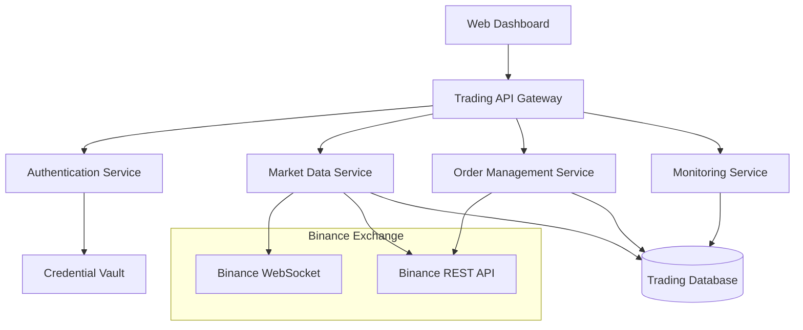

# Design Document

## Overview

The Binance Integration system provides a secure, user-friendly interface for connecting the autonomous trading system to Binance exchange. The design includes a web-based dashboard for configuration and monitoring, secure credential management, real-time market data integration, and comprehensive order execution capabilities for both Spot and Futures trading.

## Architecture

### High-Level Architecture



### Component Architecture

The system follows a microservices architecture with the following core components:

1. **Web Dashboard** - React-based UI for configuration and monitoring
2. **Trading API Gateway** - FastAPI backend coordinating all services
3. **Authentication Service** - Secure credential management and API authentication
4. **Market Data Service** - Real-time data streaming and processing
5. **Order Management Service** - Order execution and lifecycle management
6. **Monitoring Service** - Performance tracking and alerting

## Components and Interfaces

### 1. Web Dashboard (React + TypeScript)

**Purpose**: User-friendly interface for system configuration and monitoring

**Key Features**:
- Trading pair selection with searchable dropdown
- Real-time portfolio overview with P&L tracking
- Order management interface with one-click actions
- System status monitoring with health indicators
- Configuration panels for risk parameters

**Main Components**:
```typescript
interface DashboardProps {
  tradingPairs: TradingPair[];
  portfolio: Portfolio;
  activeOrders: Order[];
  systemStatus: SystemStatus;
}

interface TradingPairSelector {
  availablePairs: string[];
  selectedPairs: string[];
  onSelectionChange: (pairs: string[]) => void;
}

interface PortfolioOverview {
  spotBalance: Balance[];
  futuresPositions: Position[];
  totalPnL: number;
  dailyPnL: number;
}
```

### 2. Trading API Gateway (FastAPI)

**Purpose**: Central coordination point for all trading operations

**Key Endpoints**:
```python
@app.get("/api/v1/trading-pairs")
async def get_trading_pairs() -> List[TradingPair]

@app.post("/api/v1/orders")
async def place_order(order: OrderRequest) -> OrderResponse

@app.get("/api/v1/portfolio")
async def get_portfolio() -> Portfolio

@app.get("/api/v1/market-data/{symbol}")
async def get_market_data(symbol: str) -> MarketData

@app.post("/api/v1/config/trading-pairs")
async def update_trading_pairs(pairs: List[str]) -> ConfigResponse
```

### 3. Authentication Service

**Purpose**: Secure management of Binance API credentials

**Implementation**:
```python
class BinanceAuthenticator:
    def __init__(self, api_key: str, secret_key: str):
        self.api_key = api_key
        self.secret_key = secret_key
    
    def generate_signature(self, query_string: str) -> str:
        return hmac.new(
            self.secret_key.encode('utf-8'),
            query_string.encode('utf-8'),
            hashlib.sha256
        ).hexdigest()
    
    def get_headers(self) -> Dict[str, str]:
        return {
            'X-MBX-APIKEY': self.api_key,
            'Content-Type': 'application/json'
        }
```

### 4. Market Data Service

**Purpose**: Real-time market data streaming and processing

**WebSocket Integration**:
```python
class BinanceMarketDataStream:
    async def connect_kline_stream(self, symbols: List[str], intervals: List[str]):
        streams = [f"{symbol.lower()}@kline_{interval}" for symbol in symbols for interval in intervals]
        ws_url = f"wss://stream.binance.com:9443/ws/{'/'.join(streams)}"
        
    async def connect_ticker_stream(self, symbols: List[str]):
        streams = [f"{symbol.lower()}@ticker" for symbol in symbols]
        
    async def handle_market_data(self, data: dict):
        # Process and store market data
        # Update technical indicators
        # Trigger trading signals
```

### 5. Order Management Service

**Purpose**: Order execution and lifecycle management

**Order Types Support**:
```python
class OrderManager:
    async def place_spot_order(self, order: SpotOrderRequest) -> OrderResponse:
        # Validate order parameters
        # Check account balance
        # Submit to Binance Spot API
        
    async def place_futures_order(self, order: FuturesOrderRequest) -> OrderResponse:
        # Validate margin requirements
        # Check position limits
        # Submit to Binance Futures API
        
    async def cancel_order(self, symbol: str, order_id: str) -> CancelResponse:
        # Cancel order on Binance
        # Update local order status
```

## Data Models

### Core Trading Models

```python
from pydantic import BaseModel
from typing import Optional, List
from decimal import Decimal
from datetime import datetime

class TradingPair(BaseModel):
    symbol: str
    base_asset: str
    quote_asset: str
    status: str
    min_qty: Decimal
    max_qty: Decimal
    step_size: Decimal
    tick_size: Decimal

class Order(BaseModel):
    id: str
    client_order_id: str
    symbol: str
    side: str  # BUY, SELL
    type: str  # MARKET, LIMIT, STOP_LOSS, etc.
    quantity: Decimal
    price: Optional[Decimal]
    status: str
    created_at: datetime
    updated_at: datetime

class Position(BaseModel):
    symbol: str
    side: str  # LONG, SHORT
    size: Decimal
    entry_price: Decimal
    mark_price: Decimal
    unrealized_pnl: Decimal
    margin: Decimal
    leverage: int

class Portfolio(BaseModel):
    spot_balances: List[Balance]
    futures_positions: List[Position]
    total_wallet_balance: Decimal
    total_unrealized_pnl: Decimal
    total_margin_balance: Decimal

class Balance(BaseModel):
    asset: str
    free: Decimal
    locked: Decimal
```

### Configuration Models

```python
class TradingConfig(BaseModel):
    selected_pairs: List[str]
    max_positions: int
    risk_per_trade: Decimal
    max_leverage: int
    enable_spot: bool
    enable_futures: bool
    
class RiskConfig(BaseModel):
    max_daily_loss: Decimal
    max_drawdown: Decimal
    position_size_limit: Decimal
    correlation_limit: Decimal
```

## Error Handling

### Error Classification and Response

```python
class BinanceErrorHandler:
    ERROR_CODES = {
        -1021: "Timestamp outside recv window",
        -1022: "Invalid signature",
        -2010: "New order rejected",
        -2011: "Cancel rejected",
        -1013: "Invalid quantity",
        -1111: "Precision over maximum"
    }
    
    async def handle_api_error(self, error_code: int, message: str):
        if error_code in [-1021, -1022]:  # Auth errors
            await self.refresh_credentials()
        elif error_code == -2010:  # Order rejected
            await self.validate_order_parameters()
        elif error_code in [-1013, -1111]:  # Parameter errors
            await self.adjust_order_precision()
        else:
            await self.log_unknown_error(error_code, message)
```

### Circuit Breaker Implementation

```python
class CircuitBreaker:
    def __init__(self, failure_threshold: int = 5, timeout: int = 60):
        self.failure_threshold = failure_threshold
        self.timeout = timeout
        self.failure_count = 0
        self.last_failure_time = None
        self.state = "CLOSED"  # CLOSED, OPEN, HALF_OPEN
    
    async def call(self, func, *args, **kwargs):
        if self.state == "OPEN":
            if time.time() - self.last_failure_time > self.timeout:
                self.state = "HALF_OPEN"
            else:
                raise CircuitBreakerOpenError()
        
        try:
            result = await func(*args, **kwargs)
            self.on_success()
            return result
        except Exception as e:
            self.on_failure()
            raise e
```

## Testing Strategy

### Unit Testing

1. **Authentication Service Tests**
   - Signature generation validation
   - Header construction verification
   - Credential rotation testing

2. **Market Data Service Tests**
   - WebSocket connection handling
   - Data parsing and validation
   - Reconnection logic testing

3. **Order Management Tests**
   - Order parameter validation
   - Balance checking logic
   - Order status tracking

### Integration Testing

1. **Binance API Integration**
   - Testnet connectivity verification
   - Order placement and cancellation
   - Market data streaming validation

2. **Database Integration**
   - Data persistence verification
   - Query performance testing
   - Transaction integrity checks

### End-to-End Testing

1. **Complete Trading Workflow**
   - User selects trading pairs via UI
   - System receives market data
   - Orders are placed and executed
   - Portfolio is updated in real-time

2. **Error Scenario Testing**
   - API failure handling
   - Network disconnection recovery
   - Invalid order rejection handling

### Performance Testing

1. **Load Testing**
   - Concurrent WebSocket connections
   - High-frequency order placement
   - Market data processing throughput

2. **Latency Testing**
   - Order execution speed
   - Market data delivery latency
   - UI responsiveness under load

## Security Considerations

### Credential Management

```python
class SecureCredentialManager:
    def __init__(self):
        self.vault = VaultClient()
    
    def store_credentials(self, api_key: str, secret_key: str):
        encrypted_key = self.encrypt(api_key)
        encrypted_secret = self.encrypt(secret_key)
        self.vault.store("binance_api_key", encrypted_key)
        self.vault.store("binance_secret_key", encrypted_secret)
    
    def get_credentials(self) -> Tuple[str, str]:
        encrypted_key = self.vault.get("binance_api_key")
        encrypted_secret = self.vault.get("binance_secret_key")
        return self.decrypt(encrypted_key), self.decrypt(encrypted_secret)
```

### API Security

1. **Request Signing**: All requests signed with HMAC-SHA256
2. **Timestamp Validation**: Requests include timestamp within 5-second window
3. **Rate Limiting**: Implement client-side rate limiting to prevent API blocks
4. **IP Whitelisting**: Configure Binance API keys with IP restrictions

### Data Protection

1. **Encryption at Rest**: All sensitive data encrypted in database
2. **Secure Transmission**: All API communications over HTTPS/WSS
3. **Audit Logging**: Comprehensive logging without exposing credentials
4. **Access Control**: Role-based access to different system functions

## Deployment Architecture

### Production Environment

```yaml
# docker-compose.yml
version: '3.8'
services:
  web-dashboard:
    build: ./frontend
    ports:
      - "3000:3000"
    environment:
      - REACT_APP_API_URL=http://api-gateway:8000
  
  api-gateway:
    build: ./backend
    ports:
      - "8000:8000"
    environment:
      - DATABASE_URL=postgresql://user:pass@db:5432/trading
      - REDIS_URL=redis://redis:6379
    depends_on:
      - db
      - redis
  
  db:
    image: postgres:14
    environment:
      - POSTGRES_DB=trading
      - POSTGRES_USER=user
      - POSTGRES_PASSWORD=pass
    volumes:
      - postgres_data:/var/lib/postgresql/data
  
  redis:
    image: redis:7-alpine
    ports:
      - "6379:6379"

volumes:
  postgres_data:
```

### Monitoring and Alerting

```python
class SystemMonitor:
    def __init__(self):
        self.metrics = MetricsCollector()
        self.alerter = AlertManager()
    
    async def monitor_api_health(self):
        # Check API connectivity
        # Monitor response times
        # Track error rates
        
    async def monitor_trading_performance(self):
        # Track P&L metrics
        # Monitor position sizes
        # Check risk limits
        
    async def send_alerts(self, alert_type: str, message: str):
        # Email notifications
        # Slack/Discord webhooks
        # SMS for critical alerts
```