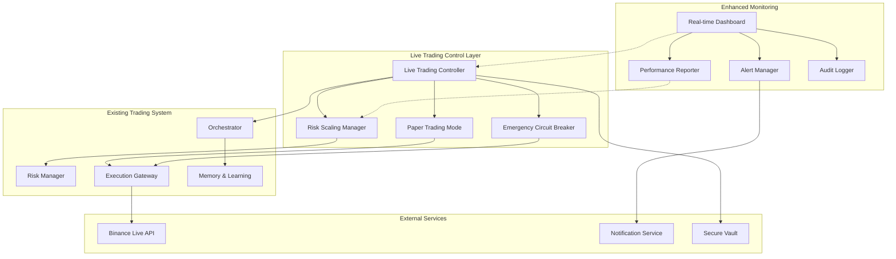

# Design Document

## Overview

The Live Trading Execution system is designed as a controlled deployment layer on top of the existing autonomous trading infrastructure. It implements a progressive risk management approach that starts with paper trading validation, transitions to minimal live exposure, and gradually scales based on performance validation. The design emphasizes safety, monitoring, and reversibility at every stage.

The system leverages the existing orchestrator, risk management, and execution components while adding specialized live trading controls, enhanced monitoring, and progressive scaling logic.

## Architecture



## Components and Interfaces

### Live Trading Controller
**Purpose**: Central coordinator for live trading operations with progressive risk management.

**Key Responsibilities**:
- Manage trading mode transitions (Paper → Live → Scaled)
- Enforce risk limits and scaling rules
- Coordinate with existing orchestrator
- Handle emergency stops and circuit breakers

**Interfaces**:
```python
class LiveTradingController:
    def start_paper_trading(self, duration_days: int = 7) -> bool
    def validate_paper_trading_results(self) -> ValidationResult
    def transition_to_live_trading(self) -> bool
    def scale_trading_operations(self, new_risk_level: float) -> bool
    def emergency_stop(self, reason: str) -> None
    def get_current_status(self) -> TradingStatus
```

### Risk Scaling Manager
**Purpose**: Manages progressive scaling of risk exposure based on performance validation.

**Key Responsibilities**:
- Calculate appropriate risk levels based on performance
- Validate scaling prerequisites
- Implement gradual exposure increases
- Monitor correlation and concentration limits

**Interfaces**:
```python
class RiskScalingManager:
    def calculate_next_risk_level(self, performance: PerformanceMetrics) -> float
    def validate_scaling_conditions(self) -> ScalingValidation
    def apply_risk_scaling(self, new_level: float) -> bool
    def monitor_concentration_risk(self) -> ConcentrationReport
    def adjust_for_market_volatility(self, volatility: float) -> float
```

### Paper Trading Mode
**Purpose**: Simulates live trading without real order execution for validation.

**Key Responsibilities**:
- Execute complete trading logic without real orders
- Track simulated positions and P&L
- Generate performance metrics identical to live trading
- Validate system components under realistic conditions

**Interfaces**:
```python
class PaperTradingMode:
    def execute_simulated_trade(self, signal: TradingSignal) -> SimulatedTrade
    def update_simulated_portfolio(self) -> Portfolio
    def calculate_simulated_pnl(self) -> float
    def generate_validation_report(self) -> ValidationReport
    def compare_with_backtest(self) -> ComparisonReport
```

### Emergency Circuit Breaker
**Purpose**: Provides immediate trading halt capabilities with configurable triggers.

**Key Responsibilities**:
- Monitor system health and performance metrics
- Trigger automatic stops based on predefined conditions
- Execute emergency position closure
- Implement cooldown periods and recovery procedures

**Interfaces**:
```python
class EmergencyCircuitBreaker:
    def register_trigger(self, condition: TriggerCondition, action: EmergencyAction) -> None
    def check_triggers(self, current_state: SystemState) -> List[TriggeredCondition]
    def execute_emergency_stop(self, reason: str) -> EmergencyResponse
    def close_all_positions(self, method: str = "market") -> List[OrderResult]
    def enter_cooldown(self, duration: timedelta) -> None
```

### Real-time Dashboard
**Purpose**: Provides comprehensive monitoring and visualization of live trading operations.

**Key Responsibilities**:
- Display real-time positions, P&L, and system status
- Show performance metrics and trend analysis
- Provide manual override controls
- Generate alerts and notifications

**Interfaces**:
```python
class RealtimeDashboard:
    def update_position_display(self, positions: List[Position]) -> None
    def update_pnl_metrics(self, pnl: PnLMetrics) -> None
    def display_system_health(self, health: SystemHealth) -> None
    def show_performance_trends(self, metrics: PerformanceHistory) -> None
    def handle_manual_override(self, command: OverrideCommand) -> bool
```

## Data Models

### Live Trading Configuration
```python
@dataclass
class LiveTradingConfig:
    mode: TradingMode  # PAPER, LIVE_MINIMAL, LIVE_SCALED
    max_risk_per_trade: float
    max_portfolio_exposure: float
    daily_loss_limit: float
    allowed_symbols: List[str]
    scaling_enabled: bool
    emergency_triggers: List[EmergencyTrigger]
    
@dataclass
class TradingMode:
    PAPER = "paper"
    LIVE_MINIMAL = "live_minimal"
    LIVE_SCALED = "live_scaled"
    EMERGENCY_STOP = "emergency_stop"
```

### Performance Validation Models
```python
@dataclass
class ValidationResult:
    passed: bool
    win_rate: float
    sharpe_ratio: float
    max_drawdown: float
    total_trades: int
    profit_factor: float
    validation_period: timedelta
    issues: List[ValidationIssue]
    
@dataclass
class ScalingValidation:
    can_scale: bool
    current_performance: PerformanceMetrics
    required_performance: PerformanceThresholds
    days_since_last_scale: int
    risk_concentration: float
    market_volatility: float
```

### Emergency Response Models
```python
@dataclass
class EmergencyTrigger:
    condition: str  # "drawdown_exceeded", "api_failure", "manual_stop"
    threshold: float
    action: EmergencyAction
    cooldown_hours: int
    
@dataclass
class EmergencyResponse:
    trigger_reason: str
    actions_taken: List[str]
    positions_closed: List[str]
    cooldown_until: datetime
    recovery_steps: List[str]
```

## Error Handling

### Progressive Risk Management
The system implements a multi-layered approach to risk management:

1. **Validation Layer**: Paper trading must pass validation before live trading
2. **Minimal Exposure Layer**: Start with 0.1% risk per trade, 2% portfolio exposure
3. **Scaling Layer**: Gradual increases based on performance validation
4. **Emergency Layer**: Immediate stops and position closure when needed

### Error Recovery Strategies
```python
class LiveTradingErrorHandler:
    def handle_api_failure(self, error: APIError) -> RecoveryAction:
        # Switch to backup API, reduce position sizes, enter safe mode
        
    def handle_performance_degradation(self, metrics: PerformanceMetrics) -> RecoveryAction:
        # Reduce risk levels, tighten stops, increase monitoring frequency
        
    def handle_system_anomaly(self, anomaly: SystemAnomaly) -> RecoveryAction:
        # Log incident, notify operators, potentially trigger emergency stop
        
    def handle_market_volatility(self, volatility: VolatilityMetrics) -> RecoveryAction:
        # Adjust position sizes, modify stop losses, reduce trading frequency
```

### Circuit Breaker Conditions
```python
EMERGENCY_TRIGGERS = [
    EmergencyTrigger("daily_loss_exceeded", 0.01, EmergencyAction.HALT_NEW_TRADES, 4),
    EmergencyTrigger("drawdown_exceeded", 0.03, EmergencyAction.CLOSE_ALL_POSITIONS, 24),
    EmergencyTrigger("api_latency_high", 2.0, EmergencyAction.PAUSE_TRADING, 1),
    EmergencyTrigger("correlation_breach", 0.7, EmergencyAction.CLOSE_CORRELATED, 2),
    EmergencyTrigger("manual_override", 0.0, EmergencyAction.IMMEDIATE_STOP, 0)
]
```

## Testing Strategy

### Paper Trading Validation
- **Duration**: Minimum 7 days of continuous operation
- **Performance Thresholds**: Win rate >45%, Sharpe >0.5, Max DD <15%
- **System Validation**: All components must function without errors
- **Market Condition Testing**: Validate across different market regimes

### Live Trading Progression
```python
class TradingProgression:
    PHASE_1 = {
        "risk_per_trade": 0.001,  # 0.1%
        "max_exposure": 0.02,     # 2%
        "symbols": ["BTCUSDT"],
        "duration_days": 7
    }
    
    PHASE_2 = {
        "risk_per_trade": 0.0025, # 0.25%
        "max_exposure": 0.05,     # 5%
        "symbols": ["BTCUSDT", "ETHUSDT"],
        "duration_days": 14
    }
    
    PHASE_3 = {
        "risk_per_trade": 0.005,  # 0.5%
        "max_exposure": 0.10,     # 10%
        "symbols": ["BTCUSDT", "ETHUSDT", "BNBUSDT"],
        "duration_days": 30
    }
```

### Integration Testing
- **API Integration**: Test with live Binance API using minimal amounts
- **Emergency Procedures**: Simulate various failure scenarios
- **Performance Monitoring**: Validate all metrics and alerts
- **Security Testing**: Verify credential management and audit trails

### Stress Testing
- **High Volatility**: Test system behavior during market stress
- **API Failures**: Simulate exchange downtime and recovery
- **Network Issues**: Test with degraded connectivity
- **Concurrent Operations**: Validate multi-symbol trading

## Security Considerations

### Credential Management
```python
class SecureCredentialManager:
    def load_production_credentials(self) -> TradingCredentials:
        # Load from secure vault or environment variables
        
    def rotate_api_keys(self, new_credentials: TradingCredentials) -> bool:
        # Hot-swap credentials without downtime
        
    def validate_api_permissions(self) -> PermissionReport:
        # Verify API key has required permissions
        
    def monitor_api_usage(self) -> UsageReport:
        # Track API calls for anomaly detection
```

### Audit and Compliance
- **Tamper-evident Logging**: All trading decisions and actions logged with hash chains
- **Real-time Monitoring**: Continuous surveillance of trading activities
- **Regulatory Reporting**: Configurable compliance reporting for different jurisdictions
- **Access Control**: Role-based access with multi-factor authentication

The design emphasizes safety through progressive exposure, comprehensive monitoring, and multiple layers of risk controls while leveraging the existing robust trading infrastructure.