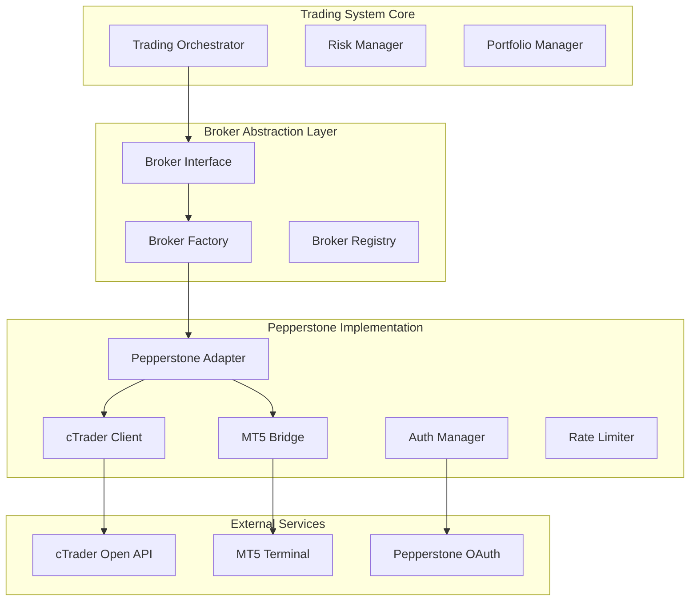
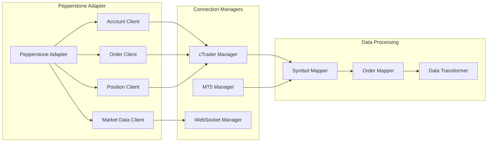

# Design Document

## Overview

The Pepperstone Integration provides a comprehensive broker abstraction layer that enables the autonomous trading system to connect with Pepperstone for Forex and CFD trading. The design implements a dual-path approach supporting both cTrader Open API and MetaTrader 5 bridge connectivity, with unified interfaces that maintain consistency with the existing Binance integration.

The architecture follows the existing trading system patterns with broker-agnostic interfaces, secure credential management, real-time data streaming, and robust error handling. This enables seamless switching between brokers while maintaining all core trading functionality.

## Architecture

### High-Level Architecture



### Component Architecture



## Components and Interfaces

### 1. Broker Interface Abstraction

**IBrokerAdapter** - Unified interface for all broker implementations:

```python
class IBrokerAdapter(ABC):
    """Abstract broker adapter interface."""
    
    @abstractmethod
    async def connect(self) -> bool:
        """Establish connection to broker."""
        pass
    
    @abstractmethod
    async def disconnect(self) -> None:
        """Disconnect from broker."""
        pass
    
    @abstractmethod
    async def get_account_info(self) -> AccountInfo:
        """Get account information."""
        pass
    
    @abstractmethod
    async def get_positions(self) -> List[Position]:
        """Get current positions."""
        pass
    
    @abstractmethod
    async def place_order(self, order: OrderRequest) -> OrderResult:
        """Place trading order."""
        pass
    
    @abstractmethod
    async def cancel_order(self, order_id: str) -> bool:
        """Cancel existing order."""
        pass
    
    @abstractmethod
    async def get_market_data(self, symbol: str, timeframe: str) -> MarketData:
        """Get historical market data."""
        pass
    
    @abstractmethod
    async def subscribe_market_data(self, symbols: List[str], callback: Callable) -> None:
        """Subscribe to real-time market data."""
        pass
```

### 2. Pepperstone Adapter Implementation

**PepperstoneAdapter** - Main implementation class:

```python
class PepperstoneAdapter(IBrokerAdapter):
    """Pepperstone broker adapter with dual connectivity."""
    
    def __init__(self, config: PepperstoneConfig):
        self.config = config
        self.connection_type = config.connection_type  # "ctrader" or "mt5"
        self.client = self._create_client()
        self.auth_manager = AuthManager(config)
        self.rate_limiter = RateLimiter(config.rate_limits)
        self.symbol_mapper = SymbolMapper()
        self.order_mapper = OrderMapper()
        
    def _create_client(self):
        """Factory method to create appropriate client."""
        if self.connection_type == "ctrader":
            return CTraderClient(self.config.ctrader)
        elif self.connection_type == "mt5":
            return MT5Bridge(self.config.mt5)
        else:
            raise ValueError(f"Unsupported connection type: {self.connection_type}")
```

### 3. cTrader Open API Client

**CTraderClient** - Handles cTrader API communication:

```python
class CTraderClient:
    """cTrader Open API client implementation."""
    
    def __init__(self, config: CTraderConfig):
        self.config = config
        self.session = None
        self.websocket = None
        self.auth_token = None
        
    async def authenticate(self) -> bool:
        """Perform OAuth2 authentication."""
        # OAuth2 flow implementation
        pass
        
    async def connect_websocket(self) -> None:
        """Establish WebSocket connection for streaming."""
        # WebSocket connection with auto-reconnect
        pass
        
    async def make_request(self, endpoint: str, data: dict = None) -> dict:
        """Make authenticated HTTP request."""
        # Rate-limited HTTP requests
        pass
```

### 4. MT5 Bridge Implementation

**MT5Bridge** - Handles MetaTrader 5 terminal communication:

```python
class MT5Bridge:
    """MetaTrader 5 bridge implementation."""
    
    def __init__(self, config: MT5Config):
        self.config = config
        self.terminal_path = config.terminal_path
        self.account_number = config.account_number
        self.password = config.password
        self.server = config.server
        
    async def initialize(self) -> bool:
        """Initialize MT5 terminal connection."""
        # MT5 terminal initialization
        pass
        
    async def login(self) -> bool:
        """Login to trading account."""
        # Account authentication
        pass
        
    async def get_tick_data(self, symbol: str) -> dict:
        """Get real-time tick data."""
        # Tick data retrieval with caching
        pass
```

### 5. Authentication Manager

**AuthManager** - Handles secure authentication:

```python
class AuthManager:
    """Manages authentication for both cTrader and MT5."""
    
    def __init__(self, config: PepperstoneConfig):
        self.config = config
        self.token_cache = {}
        self.refresh_tasks = {}
        
    async def get_ctrader_token(self) -> str:
        """Get valid cTrader OAuth token."""
        # Token management with auto-refresh
        pass
        
    async def validate_mt5_credentials(self) -> bool:
        """Validate MT5 login credentials."""
        # Credential validation
        pass
        
    async def refresh_token(self, token_type: str) -> str:
        """Refresh authentication token."""
        # Token refresh logic
        pass
```

### 6. Symbol and Order Mapping

**SymbolMapper** - Handles symbol translation:

```python
class SymbolMapper:
    """Maps internal symbols to Pepperstone format."""
    
    SYMBOL_MAP = {
        "EURUSD": "EURUSD",
        "GBPUSD": "GBPUSD", 
        "BTCUSD": "BTCUSD",
        "US30": "US30",
        "XAUUSD": "XAUUSD",
        # ... more mappings
    }
    
    def to_pepperstone_symbol(self, internal_symbol: str) -> str:
        """Convert internal symbol to Pepperstone format."""
        pass
        
    def from_pepperstone_symbol(self, pepperstone_symbol: str) -> str:
        """Convert Pepperstone symbol to internal format."""
        pass
```

**OrderMapper** - Handles order type translation:

```python
class OrderMapper:
    """Maps order types between systems."""
    
    ORDER_TYPE_MAP = {
        "MARKET": "MARKET",
        "LIMIT": "LIMIT", 
        "STOP": "STOP",
        "STOP_LIMIT": "STOP_LIMIT"
    }
    
    def to_pepperstone_order(self, internal_order: OrderRequest) -> dict:
        """Convert internal order to Pepperstone format."""
        pass
        
    def from_pepperstone_order(self, pepperstone_order: dict) -> OrderResult:
        """Convert Pepperstone order to internal format."""
        pass
```

## Data Models

### Configuration Models

```python
class PepperstoneConfig(BaseModel):
    """Pepperstone adapter configuration."""
    connection_type: str = Field(..., pattern=r"^(ctrader|mt5)$")
    demo_mode: bool = True
    ctrader: Optional[CTraderConfig] = None
    mt5: Optional[MT5Config] = None
    rate_limits: RateLimitConfig = Field(default_factory=RateLimitConfig)
    
class CTraderConfig(BaseModel):
    """cTrader API configuration."""
    client_id: str
    client_secret: str
    redirect_uri: str
    api_base_url: str = "https://openapi.ctrader.com"
    websocket_url: str = "wss://openapi.ctrader.com/ws"
    
class MT5Config(BaseModel):
    """MT5 bridge configuration."""
    terminal_path: str
    account_number: int
    password: str
    server: str
    timeout_seconds: int = 30
```

### Trading Models

```python
class PepperstoneAccountInfo(BaseModel):
    """Pepperstone account information."""
    account_id: str
    balance: float
    equity: float
    margin_used: float
    margin_free: float
    margin_level: float
    currency: str
    leverage: int
    
class PepperstonePosition(BaseModel):
    """Pepperstone position information."""
    position_id: str
    symbol: str
    side: str
    volume: float
    open_price: float
    current_price: float
    unrealized_pnl: float
    swap: float
    commission: float
    
class PepperstoneOrderRequest(BaseModel):
    """Pepperstone order request."""
    symbol: str
    order_type: str
    side: str
    volume: float
    price: Optional[float] = None
    stop_loss: Optional[float] = None
    take_profit: Optional[float] = None
    comment: Optional[str] = None
```

## Error Handling

### Error Classification

```python
class PepperstoneErrorType(Enum):
    """Pepperstone-specific error types."""
    AUTHENTICATION_ERROR = "authentication_error"
    RATE_LIMIT_EXCEEDED = "rate_limit_exceeded"
    INSUFFICIENT_MARGIN = "insufficient_margin"
    INVALID_SYMBOL = "invalid_symbol"
    MARKET_CLOSED = "market_closed"
    CONNECTION_ERROR = "connection_error"
    ORDER_REJECTED = "order_rejected"
    POSITION_NOT_FOUND = "position_not_found"

class PepperstoneException(Exception):
    """Base Pepperstone exception."""
    def __init__(self, error_type: PepperstoneErrorType, message: str, details: dict = None):
        self.error_type = error_type
        self.message = message
        self.details = details or {}
        super().__init__(message)
```

### Error Recovery Strategies

```python
class ErrorRecoveryManager:
    """Manages error recovery for Pepperstone operations."""
    
    RETRY_STRATEGIES = {
        PepperstoneErrorType.RATE_LIMIT_EXCEEDED: ExponentialBackoffRetry(max_retries=3),
        PepperstoneErrorType.CONNECTION_ERROR: LinearBackoffRetry(max_retries=5),
        PepperstoneErrorType.AUTHENTICATION_ERROR: TokenRefreshRetry(max_retries=2),
    }
    
    async def handle_error(self, error: PepperstoneException, operation: str) -> bool:
        """Handle error with appropriate recovery strategy."""
        strategy = self.RETRY_STRATEGIES.get(error.error_type)
        if strategy:
            return await strategy.execute(operation)
        return False
```

## Testing Strategy

### Unit Testing

1. **Mock API Responses**: Test all API interactions with mocked responses
2. **Symbol Mapping**: Verify correct symbol translation in both directions  
3. **Order Mapping**: Test order type conversions and validation
4. **Authentication**: Test OAuth flow and token management
5. **Error Handling**: Test all error scenarios and recovery strategies

### Integration Testing

1. **Demo Account Testing**: Full integration tests using Pepperstone demo accounts
2. **Connection Reliability**: Test reconnection logic and failover scenarios
3. **Data Accuracy**: Verify market data accuracy against known sources
4. **Order Execution**: Test order placement and execution in demo environment
5. **Performance Testing**: Measure latency and throughput under load

### End-to-End Testing

1. **Complete Trading Flow**: Test full trading cycle from signal to execution
2. **Multi-Timeframe Analysis**: Verify data consistency across timeframes
3. **Risk Management**: Test position sizing and risk controls
4. **Portfolio Management**: Verify position tracking and P&L calculations
5. **Broker Switching**: Test seamless switching between Binance and Pepperstone

## Security Considerations

### Credential Management

- OAuth tokens stored in secure environment variables
- MT5 passwords encrypted using system keyring
- Token refresh handled automatically with secure storage
- No credentials logged or exposed in error messages

### API Security

- All API calls use HTTPS/WSS with certificate validation
- Request signing for authenticated endpoints
- Rate limiting to prevent API abuse
- Circuit breakers for connection failures

### Data Protection

- Market data encrypted in transit and at rest
- Position data anonymized in logs
- Audit trail for all trading operations
- Compliance with financial data regulations

## Performance Optimizations

### Connection Management

- Connection pooling for HTTP requests
- WebSocket connection reuse with heartbeat
- Automatic reconnection with exponential backoff
- Circuit breakers to prevent cascade failures

### Data Processing

- Streaming data processing for real-time updates
- Efficient symbol mapping with caching
- Batch processing for historical data requests
- Memory-efficient data structures

### Caching Strategy

- Symbol information cached with TTL
- Market data cached with smart invalidation
- Authentication tokens cached with auto-refresh
- Position data cached with real-time updates

## Monitoring and Observability

### Metrics Collection

- API request latency and success rates
- WebSocket connection stability
- Order execution quality and slippage
- Position tracking accuracy

### Logging Strategy

- Structured logging with correlation IDs
- Separate log levels for different components
- Audit logs for all trading operations
- Performance metrics logging

### Health Checks

- Connection status monitoring
- Authentication token validity
- Market data freshness checks
- Order execution monitoring

### Alerting

- Connection failure alerts
- Authentication error notifications
- High latency warnings
- Order execution failures